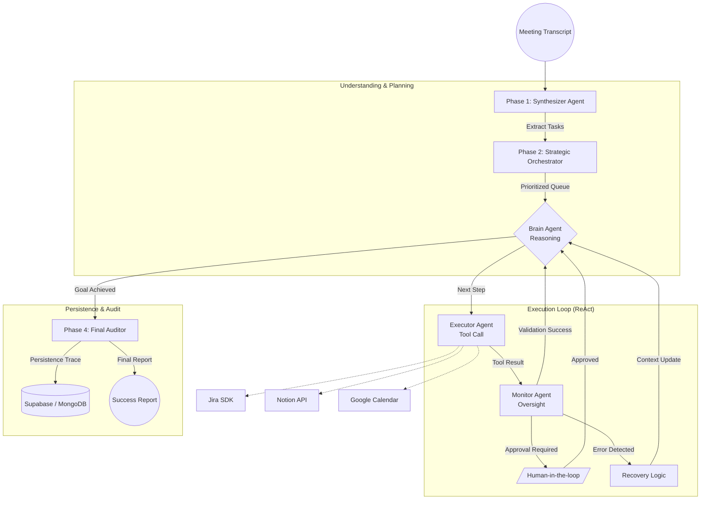

# Meeting Mind 🧠 — 100% Agentic AI Workflows

Meeting Mind is an autonomous agentic system designed to bridge the gap between human conversation and actionable technical outcomes. It transforms meeting transcripts into structured Jira tickets, Notion tasks, and Google Calendar events without manual intervention.

---

## 🚀 The Problem
Modern teams spend roughly **25% of their time** on administrative overhead—translating meeting notes into bug reports, scheduling follow-ups, and updating project trackers. These tasks are repetitive, error-prone, and slow down high-velocity engineering teams.

## 💡 The Solution: Meeting Mind
Meeting Mind replaces the "Human Middleware" with a **True Multi-Agent ReAct Workflow**. Unlike simple ChatGPT scripts, Meeting Mind:
- **Understands**: Parallel extraction agents identify technical bugs vs. administrative tasks.
- **Plans**: A Strategic Planner maps out the most efficient execution path.
- **Executes**: The Brain uses real tools (Jira SDK, Notion API, GCal) to perform actions.
- **Monitors**: An autonomous supervisor handles errors and handles human-in-the-loop approvals for high-risk actions.
- **Audits**: A final Auditor generates a unified persistence trace for complete transparency.

---

## 🧩 Agentic Architecture & Workflow

Meeting Mind is powered by a **True Multi-Agent ReAct Workflow** orchestrated via LangGraph. Below is the detailed breakdown of the roles, communication patterns, tool integrations, and error-handling logic.

### 1. Unified Architecture Diagram



### 2. Agent Roles & Responsibilities

| Agent | Core Responsibility | Key Logic / Model |
| :--- | :--- | :--- |
| **Synthesizer** | **Context Extraction**: Parses messy meeting transcripts into structured objects (Bugs, Features, Events). | Parallel LLM Extraction  |
| **Orchestrator** | **Strategic Planning**: Sequences tasks based on dependencies and priorities. Creates the `execution_queue`. | Dependency Mapping |
| **Brain** | **Reasoning (ReAct)**: Analyzes the current state and decides the specific parameters for the next tool call. | Chain-of-Thought  |
| **Executor** | **Tool Implementation**: A specialized wrapper that communicates with external APIs (Jira, Notion, GCal). | Python SDKs / REST v3 |
| **Monitor** | **Oversight & Gating**: Validates the output of the Executor. Manages the "Safety Gate" for high-risk actions. | Risk-Based Logic |
| **Auditor** | **Final Verification**: Generates a unified trace of the entire session and saves it to the long-term memory. | Persistence Layer |

### 3. Agent Communication & State Management
- **Shared State**: Every agent reads from and writes to a central `AgentState` object. This state tracks the transcript, the list of extracted tasks, the current execution step, and a chronological log of all reasoning and tool results.
- **Message Passing**: Agents communicate by updating the `AgentState`. For example, if the **Executor** fails to create a Jira ticket, it writes the error message to the state, which the **Brain** reads to determine a recovery plan.

### 4. Tool Integrations & Error Handling
Meeting Mind integrates with **Jira Cloud SDK**, **Notion API**, and **Google Calendar API**. It features 3-layer error handling:
1. **Tool-Level**: Built-in fallbacks (e.g., Atlassian SDK fallback to raw REST API).
2. **Logic-Level**: The Monitor intercepts errors and feeds them to the Brain for "re-reasoning".
3. **Autonomous Gating**: High-risk actions pause for human validation.

---

## 🛠️ Tech Stack
- **AI Core**: LangChain / LangGraph
- **Backend Core**: FastAPI (Python for Agent Engine), Node.js/Express (Gateway)
- **Frontend**: React, Next.js, Tailwind CSS
- **Persistence**: Supabase (PostgreSQL), MongoDB (Archival)

---

## 📦 Getting Started (Setup Instructions)

Follow these steps to run Meeting Mind locally.

### Prerequisites
- Python 3.10+
- Node.js 18+
- Supabase Account & Credentials
- API Credentials (Google  API, Jira, Notion)

### Installation

1. **Clone the repository**
   ```bash
   git clone https://github.com/shanmukhasaireddy13/ET-AI-HACKATHON.git
   cd ET-AI-HACKATHON
   ```
   *Note: Our `main` branch commit history reflects the structured build process and iterative development throughout the hackathon.*

2. **Setup the Agent Engine (Python/FastAPI)**
   ```bash
   cd SIDD
   python -m venv .venv
   source .venv/bin/activate  # On Windows: .venv\Scripts\activate
   pip install -r requirements.txt
   
   # Duplicate .env.example to .env and configure your keys:
   # cp .env.example .env
   
   
   python api.py
   # The Agent Engine will run on http://localhost:8000
   ```

3. **Setup the Backend Gateway (Node.js)**
   ```bash
   cd ../server
   npm install
   
   # Setup your environment variables (.env)
   # Must contain Supabase URL and keys, matching the Agent Engine
   
   npm start
   # The Gateway will run on http://localhost:5000
   ```

4. **Setup the Frontend (Next.js)**
   ```bash
   cd ../frontend
   npm install
   
   # Setup environment variables (.env.local)
   # NEXT_PUBLIC_API_URL=http://localhost:5000
   
   npm run dev
   # The Dashboard will run on http://localhost:3000
   ```

---

## 🛡️ Autonomous Safety & Gating
Meeting Mind implements a strict **Risk-Based Gating** system. 
- Actions like `create_ticket` or `schedule_meeting` execute autonomously.
- High-risk actions like `delete_jira_issue` are **Gated**, requiring human approval via the dashboard before the agent can resume its workflow.

## 📈 Impact Model

A quantified estimate of the business impact achieved by deploying Meeting Mind, based on a typical mid-sized engineering team:

**Assumptions**:
- **Team Size**: 10 Engineers / Product Managers.
- **Meeting Load**: 5 hours of meetings per week per person.
- **Admin Overhead**: Employees spend ~15 minutes after every 1 hour of meetings context-switching, writing tickets, and updating documentation (1.25 hours/week/person).
- **Average Loaded Hourly Rate**: $75/hour (~$150k/year).
- **Automation Effectiveness**: Meeting Mind automates ~80% of this post-meeting administrative overhead.

**Back-of-the-Envelope Math (Monthly Impact)**:
1. **Time Saved**: 
   - 1.25 administrative hours/week * 10 employees = 12.5 hrs/week.
   - Automation recovers 80%: 10 hours saved per week.
   - **Total Time Saved: ~40 hours/month (1 full FTE week).**
2. **Cost Reduced / Value Recovered**:
   - 40 hours/month * $75/hour = **$3,000/month ($36,000/year)**.
3. **Productivity Gain**:
   - Less context switching means fewer errors in Jira/Notion, faster issue triaging, and uninterrupted deep-work blocks, representing an unquantifiable but massive boost to developer velocity.

---
*Built for the ET AI Hackathon 2026. See the commit history for our build and iteration process.*
