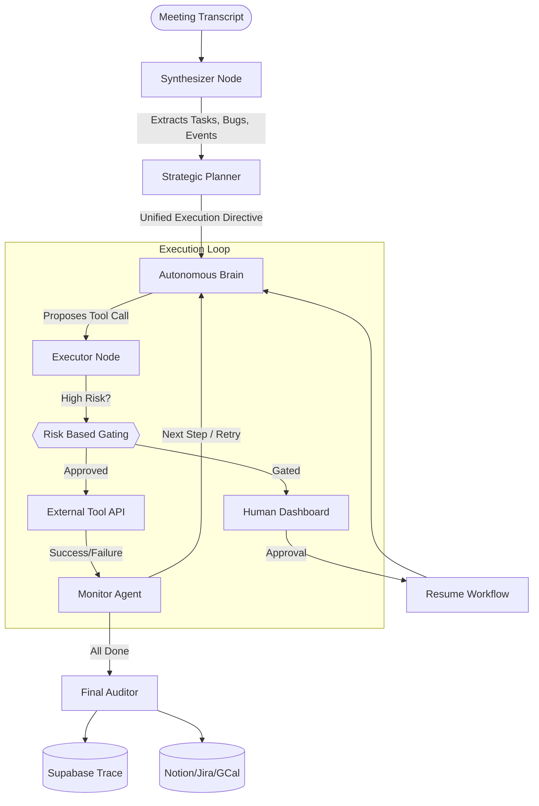

# Meeting Mind Architecture 🧠

Meeting Mind is a **Multi-Agent ReAct Workflow** built on top of LangGraph. It is designed to be autonomous, resilient, and safe for enterprise tool manipulation.

## 🏗️ System Overview

The system follows a **Standardized Five-Phase Agentic Pipeline**:

1.  **Understand** (Synthesizer): A high-performance parallel extraction node.
2.  **Plan** (Strategic Planner): Maps structured data to tool-agnostic goals.
3.  **Execute** (The Brain): A ReAct core that autonomously selects and calls tools.
4.  **Monitor** (Supervisor): Handles error recovery, retry logic, and HITL gating.
5.  **Audit** (Auditor): Ensures persistence and final state synchronization.

---

## 🗺️ Orchestration Diagram

---

## 🤖 Agent Roles & Responsibilities

### 1. The Synthesizer (Extraction)
The Synthesizer uses a unified high-context pass to eliminate the latency of sequential extraction agents. It categorizes information into four core schemas:
- **Tasks**: For administrative follow-ups (Notion-bound).
- **Bugs**: For technical defects (Jira-bound).
- **Events**: For time-boxed meetings (Google Calendar-bound).
- **Follow-ups**: For minor team coordination.

### 2. The Strategic Planner (Orchestration)
The Planner's role is to prevent "Agentic Fragmentation." It reads all extracted data and creates a single **Strategic Directive**. This directive ensures the Brain knows the priority and dependency of each task before execution starts.

### 3. The Brain (The ReAct Core)
The Brain is a "Tool-First" reasoning agent. It uses the strategic directive and meeting context to autonomously select the right tool (e.g., `create_jira_ticket`, `schedule_calendar_event`) and provide it with precise, extracted arguments.

### 4. The Executor & Gating System
The Executor is the security layer. Every tool call has a **Criticality Score (1-10)**:
- **Criticality 1-6**: Executed autonomously by the agent.
- **Criticality 7+**: Automatically Gated. The execution state is saved, and the agent pauses until a human provides an explicit "Approve" decision.

### 5. The Monitor (Recovery)
The Monitor is the self-healing layer. It watches for tool failures (e.g., Jira API 401, Invalid Dates) and autonomously decides whether to:
- **Retry**: Re-attempts the action with corrected inputs.
- **Escalate**: Requests human intervention if retries fail.
- **Continue**: Proceeds to the next task if the failure is non-critical.

---

## 📡 Communication Patterns
Agents communicate via a shared **AgentState** (Python TypedDict). This state acts as a "Short-Term Memory" containing the current directive, the execution queue, and the technical trace of all previous actions.

**Deduplication Strategy**: Every proposal is checked against the state's `execution_results` before being queued to prevent infinite loops and duplicate ticket creation.
